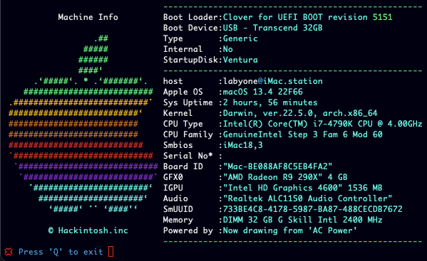

# Machine Info
Mac(hack) tool to provide hardware info 
###### Optimized for Clover Boot Loader
###### OpenCore users may have incorrect Boot Loader info
#

#
[Download](https://github.com/LAbyOne/Machine-Info/releases)

